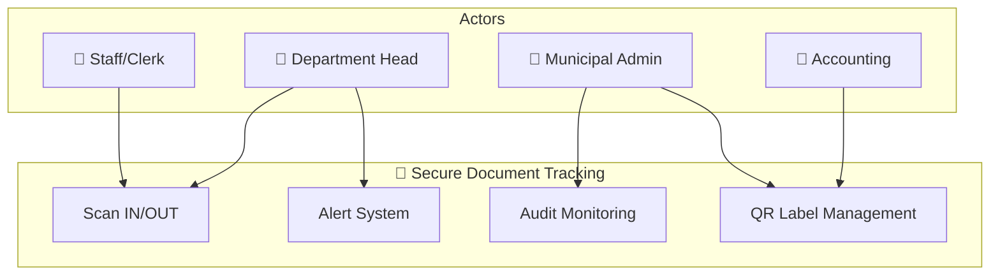
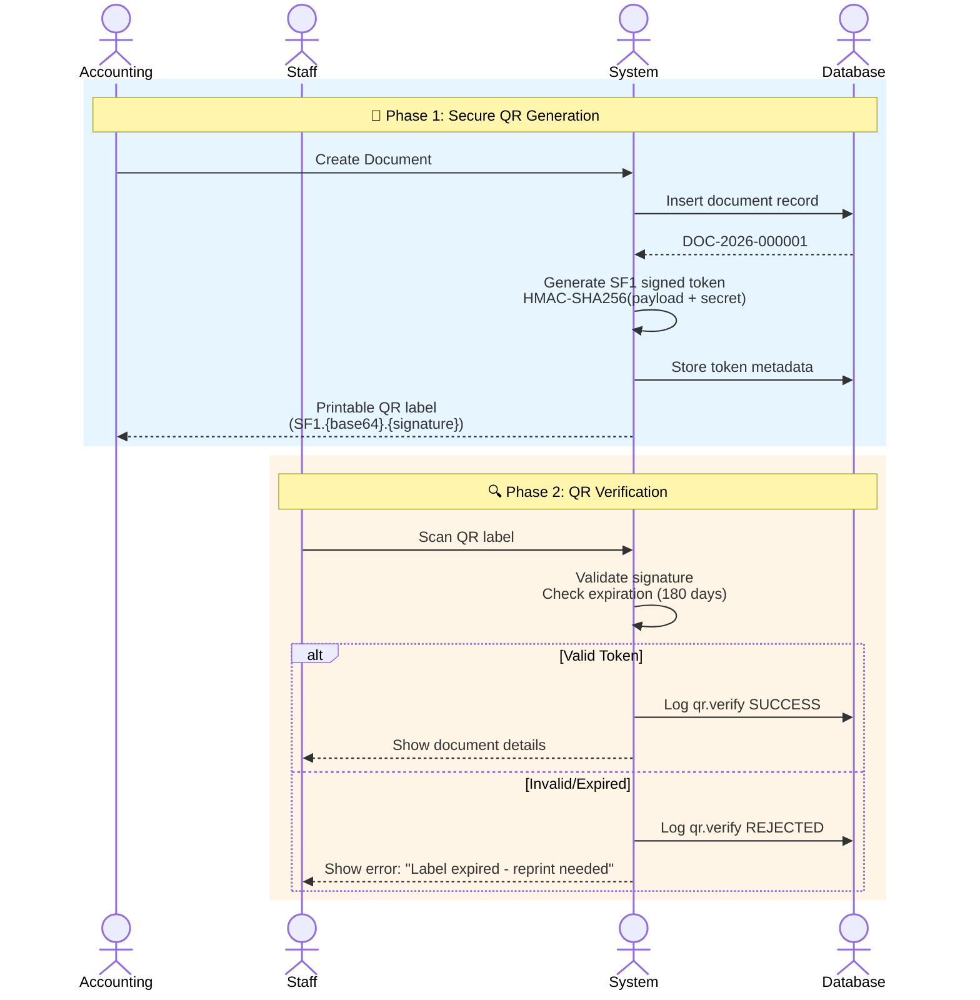
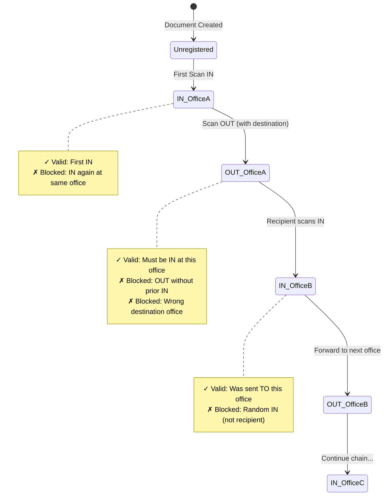
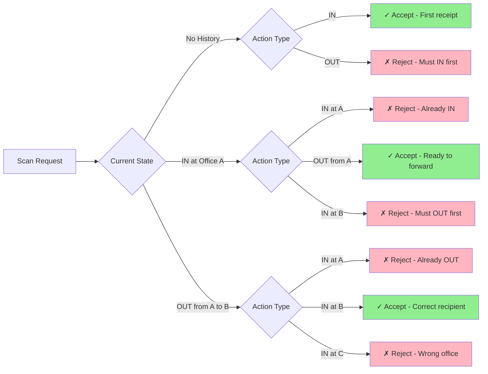
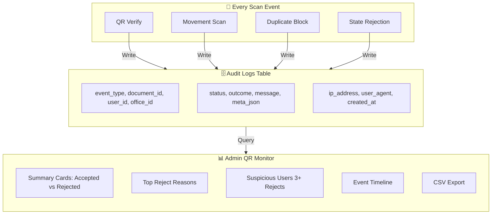
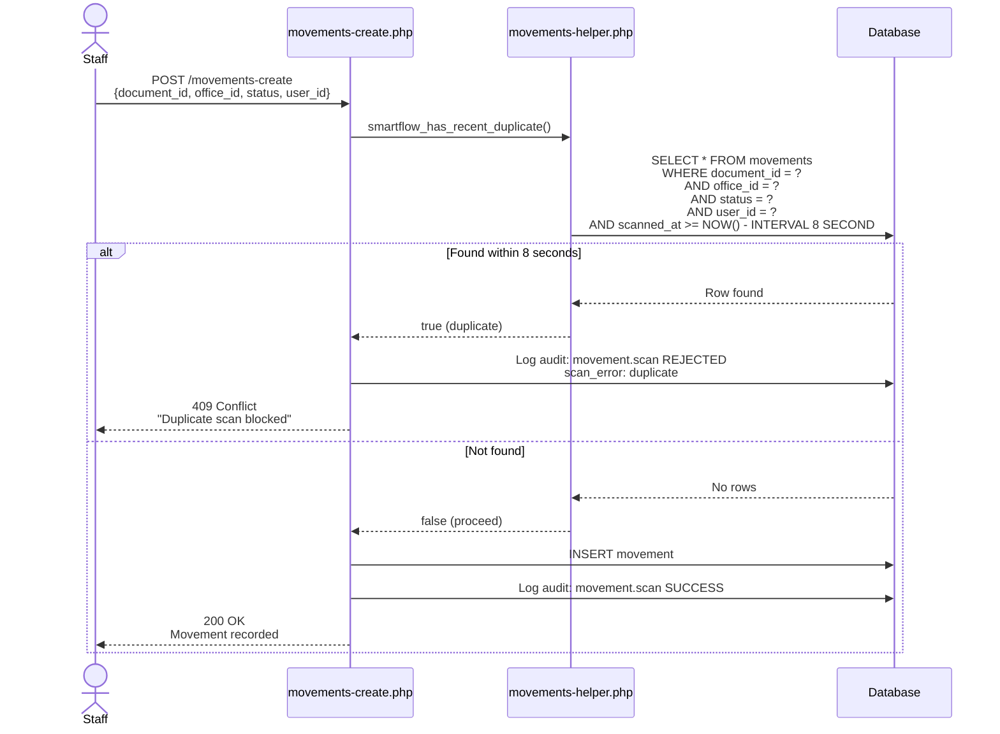
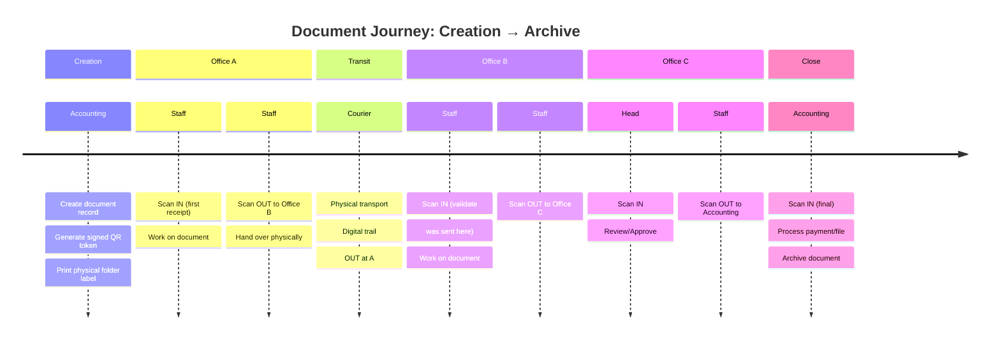
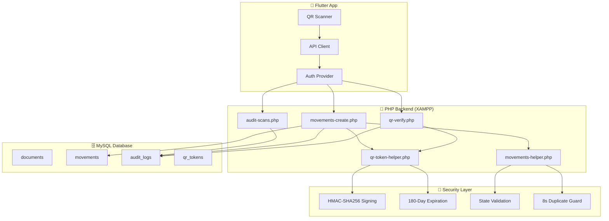

# SmartFlow Use Case Visual

## System Overview



---

## 1. QR Security Use Case



---

## 2. State-Based Scanning (IN/OUT)



---

## 3. Scan Validation Matrix



---

## 4. Audit Monitoring Flow



---

## 5. Duplicate Prevention Logic



---

## 6. Error Code Reference

```
┌────────────────────┬─────────────────────────────────────────────────┐
│ Error Code         │ Scenario                                        │
├────────────────────┼─────────────────────────────────────────────────┤
│ qr_tampered        │ QR signature invalid - possible forgery         │
│ qr_expired         │ Token past 180-day TTL - needs reprint          │
│ qr_mismatch        │ QR doc ≠ scanned doc - wrong label              │
│ duplicate          │ Same scan within 8 seconds                      │
│ already_in_here    │ Marking IN when already IN at this office       │
│ already_out_here   │ Marking IN when already OUT from this office    │
│ still_at_other_office│ Marking IN when doc at different office       │
│ wrong_receiver     │ IN scan at office not designated as recipient   │
│ not_in_at_office   │ OUT scan when doc not currently IN here         │
│ out_without_in     │ First scan is OUT (no prior IN exists)          │
│ missing_destination  │ OUT scan without selecting destination office   │
│ same_destination   │ Destination = current office                    │
│ role_forbidden     │ Admin/Accountant tried to scan (not allowed)    │
│ wrong_office       │ User scanning for different office              │
└────────────────────┴─────────────────────────────────────────────────┘
```

---

## 7. Complete Document Lifecycle



---

## 8. Security Architecture



---

## 9. Use Case Summary Table

| Use Case | Actor | Trigger | Success Outcome | Failure Handling |
|----------|-------|---------|-----------------|------------------|
| **UC1: Create Document** | Accounting | New voucher/payable | Signed QR token issued | Validation errors shown |
| **UC2: Print QR Label** | Accounting/Admin | Document registered | Printable label generated | Token regeneration option |
| **UC3: Verify QR** | Staff/Head | Camera scans QR | Document details shown | Expired/tampered error with code |
| **UC4: Scan IN** | Staff/Head | Document arrives | Movement recorded | State-based rejection with reason |
| **UC5: Scan OUT** | Staff/Head | Document forwarded | Movement + destination recorded | Missing destination or state errors |
| **UC6: Monitor Scans** | Admin | Daily audit review | Dashboard shows stats/rejects | CSV export for compliance |
| **UC7: View Suspicious Activity** | Admin | Anomaly detection | Flagged users list shown | Drill-down to user history |

---

*Generated: 2026-05-29*
*Version: Pre-Defense Implementation*
