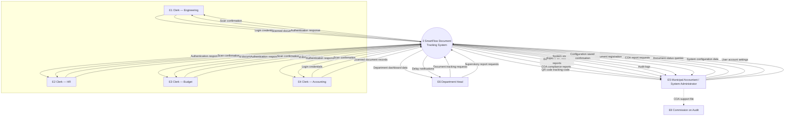

# Figure 2-2 — Four-side format (separate clerks + COA)

**Caption:** *Figure 2-2. Data Flow Diagram (Level 0 / Context Diagram) of the SmartFlow System*

Same layout style as your **four-side cross diagram** (legend: **black = input to system**, **blue = output from system**).  
**Changes:** four **separate** frontline clerk entities (not one “Frontline Staff” box) + **one E5** (Municipal Accountant **and** System Administrator — same person) + **Commission on Audit (COA)**.

**Level 0 only** — no data stores. Process = **circle** labeled **0 SmartFlow Document Tracking System**.

---

## Legend (draw in corner of figure)

| Arrow color | Meaning |
|-------------|---------|
| **Black** | Input to system (entity → 0) |
| **Blue** | Output from system (0 → entity) |
| **Black dashed** | Manual handoff outside app (E5 → E8 only) |

---

## Layout (where to place boxes)

```
                    [ E1 Eng ]  [ E2 HR ]  [ E3 Budget ]  [ E4 Acct ]
                              \    |    /
                               \   |   /
    [ E6 Dept Head ] -------- ( 0 SmartFlow ) -------- [ open ]
                               /   |   \
                              /    |    \
        [ E5 Municipal Accountant / System Administrator ]
                              |
                         (dashed)
                              v
                    [ E8 Commission on Audit (COA) ]
```

| Position | Entity |
|----------|--------|
| **Top row** (4 boxes) | E1 Engineering · E2 HR · E3 Budget · E4 Accounting clerk |
| **Left** | E6 Department Head |
| **Right** | *(empty — no separate admin box)* |
| **Bottom center** | E5 Municipal Accountant / System Administrator |
| **Below E5** | E8 COA |

---

## Entity labels (exact text in rectangles)

| ID | Rectangle label |
|----|-----------------|
| E1 | Frontline Clerk — Engineering |
| E2 | Frontline Clerk — Human Resources |
| E3 | Frontline Clerk — Budget |
| E4 | Frontline Clerk — Accounting |
| E5 | Municipal Accountant / System Administrator |
| E6 | Department Head |
| E8 | Commission on Audit (COA) |

**Center (circle):** `0 SmartFlow Document Tracking System`

---

## All arrows — black (input to system)

| From | To | Label (black arrow) |
|------|-----|---------------------|
| E1 | 0 | Login credentials |
| E1 | 0 | Scanned document records |
| E2 | 0 | Login credentials |
| E2 | 0 | Scanned document records |
| E3 | 0 | Login credentials |
| E3 | 0 | Scanned document records |
| E4 | 0 | Login credentials |
| E4 | 0 | Scanned document records |
| E6 | 0 | Document tracking requests |
| E6 | 0 | Supervisory report requests |
| E5 | 0 | System configuration data |
| E5 | 0 | User account settings |
| E5 | 0 | COA report requests |
| E5 | 0 | Document status queries |
| E5 | 0 | Document registration data |

*Registration stays on **E5** only — not on clerks (matches Figure 2-5c).*

---

## All arrows — blue (output from system)

| From | To | Label (blue arrow) |
|------|-----|-------------------|
| 0 | E1 | Authentication response |
| 0 | E1 | Scan confirmation |
| 0 | E2 | Authentication response |
| 0 | E2 | Scan confirmation |
| 0 | E3 | Authentication response |
| 0 | E3 | Scan confirmation |
| 0 | E4 | Authentication response |
| 0 | E4 | Scan confirmation |
| 0 | E6 | Department dashboard data |
| 0 | E6 | Delay notifications |
| 0 | E5 | Audit logs |
| 0 | E5 | System status reports |
| 0 | E5 | Configuration saved confirmation |
| 0 | E5 | COA compliance reports |
| 0 | E5 | Document flow status reports |
| 0 | E5 | QR code / tracking code |
| 0 | E5 | Export file (PDF / Excel) |

*Clerks do **not** receive delay alerts or full dashboard — those go to E6 and E5.*

---

## COA (dashed — not through process 0)

| From | To | Style | Label |
|------|-----|--------|--------|
| E5 | E8 | **Black dashed** | COA support file |

**No** black/blue arrows from **0** to **E8**.

---

## Cleaner option (fewer arrows per clerk)

If the top row is too busy, use **2 black + 2 blue** per clerk only:

| Clerk | Black (in) | Blue (out) |
|-------|------------|------------|
| E1–E4 each | Scanned document records | Scan confirmation |
| E1–E4 each | Login credentials | Authentication response |

---

## Mermaid Figure 2-2 — paste in mermaid.live

**Copy from:** [`figure-2-2-level-0.mmd`](figure-2-2-level-0.mmd) only — **not** this whole markdown file.

**Export:** [mermaid.live](https://mermaid.live) → PNG/SVG → Word. **No data stores** on Level 0.



Delete the two `~~~` lines if Mermaid reports a syntax error.

---

## §2.1.2 paragraph (under figure)

Figure 2-2 presents the Level 0 Data Flow Diagram of SmartFlow. Process **0** represents the SmartFlow Document Tracking System. **Four separate external entities** represent frontline clerks in Engineering, Human Resources, Budget, and Accounting; each sends login credentials and scanned document records and receives authentication responses and scan confirmations through the Flutter mobile application. The **Department Head** requests document tracking and supervisory reports and receives department dashboard data and delay notifications. The **Municipal Accountant / System Administrator (E5)**—one person in the Urbiztondo pilot—sends document registration data, document status queries, COA report requests, user account settings, and system configuration data, and receives QR tracking codes, document flow status reports, COA compliance reports, export files, audit logs, system status reports, and configuration confirmations. The **Commission on Audit** receives COA support files from the Municipal Accountant outside the system. Internal data stores are shown in Figure 2-3.

---

## Checklist

- [ ] Four **separate** clerk boxes on top (not one Frontline Staff)  
- [ ] **E5** = Municipal Accountant / System Administrator (**no E7**)  
- [ ] **Seven** entities total (E1–E4, E5, E6, E8)  
- [ ] **E8 COA** below E5, **dashed** COA support file only  
- [ ] **No** data stores on this figure  
- [ ] Process = **circle** with **0**  
- [ ] Legend: black in · blue out  
- [ ] No registration / COA reports on clerk entities  

---

## Links

| File | Use |
|------|-----|
| [`dfd-figure-2-2-arrows-reference.md`](dfd-figure-2-2-arrows-reference.md) | Full arrow list (alternate labels) |
| [`dfd-figure-2-3-level-1.md`](dfd-figure-2-3-level-1.md) | D1–D8 data stores |
