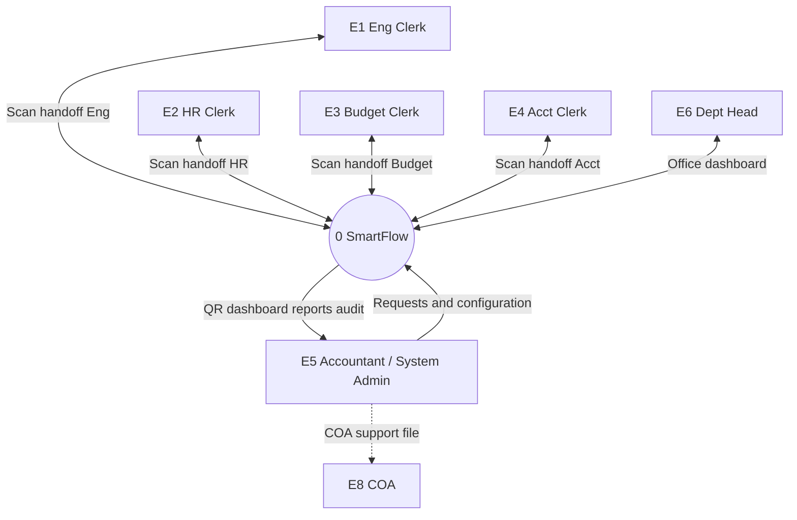

# Figure 2-2 — DFD Level 0 (Context Diagram only)

**Caption:** *Figure 2-2. Data Flow Diagram (Level 0 / Context Diagram) of the SmartFlow System*

**Chapter II §2.1.2** · **[Four-side format (Figure 2-2) →](dfd-figure-2-2-four-side-format.md)** · **[Level 1 (Figure 2-3) →](dfd-figure-2-3-level-1.md)** · [Eraser L0](eraser-figure-2-2-level-0.md)

---

## Strict DFD rule (Option A)

**Level 0** = **one process (0)** + **external entities** + **labeled data flows** — **no data stores** (D1–D8 on Figure 2-3 only).

---

## External entities (4 on diagram + optional COA)

**Matches your Word Figure 2-2 layout** (top / left / bottom around process **0**).

**Pilot rule:** **Municipal Accountant** and **System Administrator** = **one box** at the bottom — **no separate Admin on the right**.

| Position | Label on diagram |
|----------|------------------|
| **Top** | Frontline Staff (Accounting, Budget, HR, Engineering) |
| **Left** | Department Head |
| **Bottom** | Municipal Accountant / System Administrator |
| **Below bottom** *(optional)* | Commission on Audit (COA) — dashed **only** to Accountant box |

| Count | |
|-------|--|
| **Process** | **0** SmartFlow Document Tracking System |
| **External entities** | **3** connected to **0** (+ **E8 COA** manual handoff) |
| **Data stores on this figure** | **0** |

**Mermaid:** [`figure-2-2-level-0-clean.mmd`](figure-2-2-level-0-clean.mmd)

**Alternate (thesis detail):** four **separate** clerk boxes E1–E4 — use only if adviser requires split clerks on Level 0.

**Note:** All four clerks use the **same Flutter scan workflow** (one system flowchart, Figure 2-5). The DFD shows **four separate entities** because each office has its own clerks scanning at handoff — adviser “no grouping” rule.

**Optional later:** split **Department Head** into per-office heads (ask adviser first). Default: **one E6** (head monitors **their** office via login; office is in data store D2).

---

## Correct shapes

| Element | Symbol |
|---------|--------|
| External entity | **Rectangle** |
| Process (0) | **Circle** |
| Data flow | **Arrow** + label |
| Data store | **Not on Figure 2-2** |

---

## Fix messy arrows (read this before Word)

**Why it looked messy:** four clerks in one row + two arrows each (scan in + scan out) → **8 lines** hitting the **same edge** of the circle → crossings and overlapping labels.

### Rule 1 — One clerk per **side** of the circle (no row of four)

| Entity | Put box here | Attach arrow to process **0** at |
|--------|--------------|----------------------------------|
| **E1** Engineering Clerk | **Top** | 12 o’clock (top of circle) |
| **E2** HR Clerk | **Left** | 9 o’clock (left) |
| **E3** Budget Clerk | **Right** | 3 o’clock (right) |
| **E4** Accounting Clerk | **Bottom** (above E5) | 6 o’clock (bottom) |
| **E6** Department Head | **Upper-left** (not on top of E2) | between 10–11 o’clock |
| **E5** Municipal Accountant / System Administrator | **Lower-center** (wider box) | 5–7 o’clock |
| **E8** COA | **Below E5** | no line to 0 — only **E5 → E8** dashed |

### Rule 2 — Fewer arrows (same meaning, cleaner)

**Clerks (E1–E4):** use **one bidirectional arrow** each (two-headed OR one line + label both ways):

| Between | Single label |
|---------|----------------|
| E1 ↔ 0 | Scan handoff (Engineering) |
| E2 ↔ 0 | Scan handoff (Human Resources) |
| E3 ↔ 0 | Scan handoff (Budget) |
| E4 ↔ 0 | Scan handoff (Accounting) |

*Still four **separate entity** boxes — only combining the **arrow lines**, not the clerks.*

**Accountant / System Admin (E5):** combine accountant + admin flows (still keep readable — up to **5 arrows**):

| Direction | Label |
|-----------|--------|
| E5 → 0 | Registration, report requests, and system configuration |
| 0 → E5 | QR code, municipal dashboard, and COA export |
| 0 → E5 | Audit logs and system status reports |
| 0 → E5 | Configuration saved confirmation *(optional second out-arrow)* |

*On a busy diagram, merge to **3 bidirectional groups** as in the full list below.*

**Head (E6):** **2 arrows** — request in · dashboard and alerts out  

**COA:** **E5 → E8** dashed only — **no** arrow from 0 to E8

### Rule 3 — Word / Lucidchart drawing tips

- Use **curved** or **elbow** connectors, not straight lines through the center.  
- In Lucidchart: drag connector to **different anchor points** on the circle.  
- Place **labels mid-arrow**, not on top of each other.  
- **Landscape** page, large circle for **0**.  
- Do **not** put E2, E3, E4 in a tight row under the circle.

### Clean layout (ASCII — copy this placement)

```
                    ┌─────────────┐
                    │ E1 Eng Clerk│
                    └──────┬──────┘
                           │ Scan handoff (Eng)
     ┌────────────┐        │        ┌────────────┐
     │ E6 Dept    │◄───────┼───────►│ (open)   │
     │    Head    │        │        │          │
     └────────────┘        │        └──────────┘
           ▲               ╭┴╮
           │          ╭────0────╮
     Scan │          │SmartFlow│
     handoff│         ╰────┬────╯
     (HR)  │    ┌─────────┼─────────┐      │
     ┌─────┴───┐│         │         │┌─────┴────┐
     │E2 HR    ││         │         ││E3 Budget │
     │ Clerk   ││         │         ││ Clerk    │
     └─────────┘│         │         │└──────────┘
                │         │
                │    ┌────┴─────┐
                │    │ E4 Acct  │
                │    │  Clerk   │
                │    └────┬─────┘
                │         │
                │    ┌────┴──────────┐
                └───►│ E5 Municipal Accountant │
                     │    / System Admin       │
                     └───────┬───────┘
                             │ COA support file (dashed)
                             ▼
                     ┌───────────────┐
                     │ E8 COA        │
                     └───────────────┘
```

---

## Data flows (full list — use shortened arrows above on the figure)

### E1–E4 Frontline Clerks ↔ 0

| Direction | Label (full) | On diagram use |
|-----------|--------------|----------------|
| E1 ↔ 0 | Scan data / confirmation | **Scan handoff (Engineering)** — one arrow |
| E2 ↔ 0 | Scan data / confirmation | **Scan handoff (HR)** — one arrow |
| E3 ↔ 0 | Scan data / confirmation | **Scan handoff (Budget)** — one arrow |
| E4 ↔ 0 | Scan data / confirmation | **Scan handoff (Accounting)** — one arrow |

### E5 Municipal Accountant / System Administrator ↔ 0

| Direction | Label (full) | On diagram use |
|-----------|--------------|----------------|
| E5 → 0 | Registration, dashboard request, complete | **Registration and report requests** |
| E5 → 0 | User account data, office configuration, processing time thresholds | **System configuration data** |
| 0 → E5 | QR, dashboard, alerts, analytics | **QR and municipal dashboard** |
| 0 → E5 | COA report, export | **COA flow summary report and export** |
| 0 → E5 | Audit logs, system status reports | **Audit logs and system status** |
| 0 → E5 | Configuration saved confirmation | **Configuration saved confirmation** |

### E6 Department Head ↔ 0

| Direction | Label |
|-----------|--------|
| E6 → 0 | Office dashboard request |
| 0 → E6 | Office dashboard |
| 0 → E6 | Overdue flags |
| 0 → E6 | Office analytics |

### E5 → E8 (manual)

| Direction | Label |
|-----------|--------|
| E5 → E8 | COA support file *(dashed)* |

---

## Mermaid — your Word layout (top / left / bottom)

| File | Use |
|------|-----|
| [`figure-2-2-level-0-clean.mmd`](figure-2-2-level-0-clean.mmd) | **Use this** — matches your colored diagram |
| [`figure-2-2-level-0-template.mmd`](figure-2-2-level-0-template.mmd) | Same layout, duplicate of clean |
| [`figure-2-2-level-0.mmd`](figure-2-2-level-0.mmd) | Same, no line breaks in labels |

```
        [ Frontline Staff ]
[ Dept Head ] — ( 0 ) —
        [ Accountant / System Admin ]
              [ COA ]  (dashed)
```

Paste **only** the `.mmd` file into [mermaid.live](https://mermaid.live) → Export PNG. In Word, color **black** = into **0**, **blue** = out of **0**.

---

## Mermaid preview (cardinal layout — fewer crossings)

*Layout hint only; draw in Word with correct shapes.*



*In Word, position E1 top, E2 left, E3 right, E4 bottom — not in one row.*

---

## §2.1.2 paragraph (under Figure 2-2)

Figure 2-2 is the Level 0 Data Flow Diagram (context diagram) of SmartFlow. It shows **one process**—**0 SmartFlow Document Tracking System**—**seven separate external entities**, and **labeled data flows** only; internal data stores appear in Figure 2-3. **Frontline clerks** are represented separately as **E1 (Engineering)**, **E2 (Human Resources)**, **E3 (Budget)**, and **E4 (Accounting)**; each sends **scan data** and receives **scan confirmation** through the Flutter mobile application at document handoffs. **Municipal Accountant / System Administrator (E5)**—one person in the Urbiztondo pilot—registers documents, receives dashboards, alerts, **COA flow summary reports**, and exports, and also sends **user account settings** and **system configuration data** while receiving **audit logs**, **system status reports**, and **configuration confirmations**. **Department Head (E6)** receives office-level monitoring data. **Commission on Audit (E8)** receives **COA support files** from the Municipal Accountant outside the system. Persistent data are defined in Figures 2-3 and 2-6.

---

## Checklist

- [ ] **Seven** separate entity rectangles (E1–E4, E5, E6, E8 — **no E7**)  
- [ ] **E5** labeled **Municipal Accountant / System Administrator** (one box)  
- [ ] **Four** clerk boxes — not one grouped clerk  
- [ ] **No** D1–D8 on Level 0  
- [ ] Process **0** = circle  
- [ ] COA: **0 → E5** report · **E5 → E8** support file (dashed) — **no 0 → E8**  
- [ ] Clerks on **four sides** of 0 — not four in one row  
- [ ] **One arrow per clerk** (bidirectional scan handoff) or separate anchor points  
- [ ] Figure 2-3 has data stores + subprocesses  

---

## Where D1–D8 went

| Figure | Content |
|--------|---------|
| **2-2** | Context — E1–E8, no stores |
| **2-3** | Level 1 — D1–D8 |
| **2-6** | ERD |

See [`dfd-figure-2-3-level-1.md`](dfd-figure-2-3-level-1.md).
