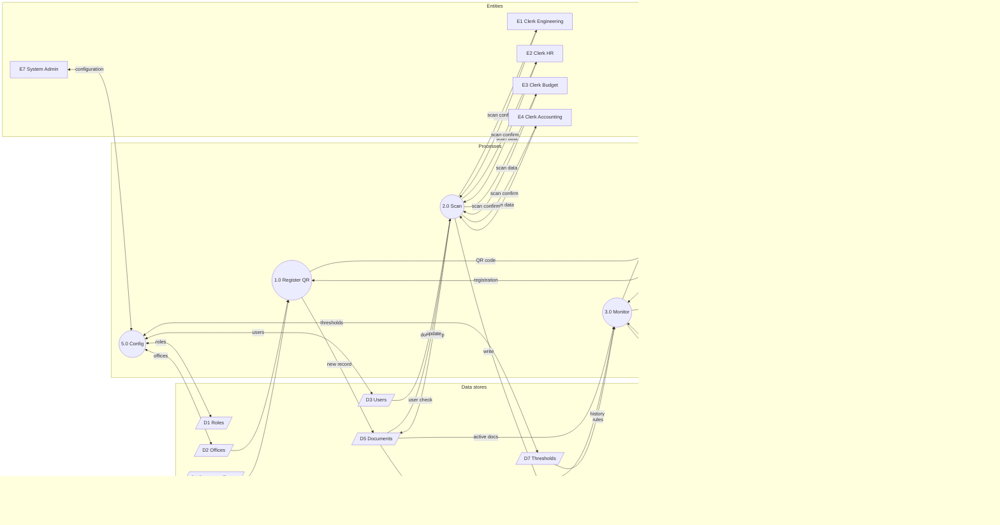

    # Figure 2-3 — DFD Level 1 (Mermaid)

    **Caption:** *Figure 2-3. Data Flow Diagram (Level 1) of the SmartFlow System*

    **Chapter II §2.1.2** · [← Level 0 (Mermaid)](dfd-figure-2-2-four-side-format.md#mermaid-figure-2-2--paste-in-mermaidlive) · [ERD](erd.md)

**Export:** [mermaid.live](https://mermaid.live) → **PNG/SVG** → Word

### IMPORTANT — fix “No diagram type detected” error

You pasted the **whole `.md` file** (tables, `|`, `##` headings). Mermaid only accepts **diagram code**.

**Do this instead:**

1. Open file **[`figure-2-3-level-1.mmd`](figure-2-3-level-1.mmd)** in this folder  
2. **Ctrl+A → Ctrl+C** (copy all)  
3. [mermaid.live](https://mermaid.live) → delete everything → **Ctrl+V**  
4. Export PNG  

Or copy **only** the code inside the ` ```mermaid ` fence below — **not** the markdown table above it.

---

## Your preview — what’s wrong?

If Mermaid drew **1.0 → 5.0**, **1.0 → 2.0**, **3.0 → 5.0**, or **5.0 ← 3.0 / 2.0**, that is **incorrect**. Those lines come from the **old simple diagram** chaining processes in one row.

| Wrong arrow | Why |
|-------------|-----|
| 1.0 → 2.0 or 1.0 → 5.0 | Processes do **not** chain to each other |
| 2.0 ← 1.0 | Scans do **not** flow through Register |
| 3.0 → D2 | Monitor does **not** write Offices |
| 3.0 → 5.0 | Monitor does **not** feed Config |
| 5.0 ← D6, 5.0 ← 1.0 | Admin only uses **D1, D2, D3, D7** |
| 4.0 → E6 only | Must also go to **E5** + **E5 -.-> E8** |

**Use the diagram below** (recommended) — stores left · processes center · entities right · **four separate clerks**.

---

## Mermaid shape key

    | DFD element | Mermaid syntax |
    |-------------|----------------|
    | Subprocess | `((1.0 Name))` — circle |
    | External entity | `[E1 Name]` — rectangle |
    | Data store | `[/D1 Name/]` — parallelogram *(closest; redraw as parallel lines in Word if required)* |
    | Dashed flow | `-.->` |
    | **Not used** | `[( )]` cylinder |

    ---

    ## Figure 2-3 — full diagram (copy from here)

    Paste into [mermaid.live](https://mermaid.live). Use **landscape** export.

    ```mermaid
    flowchart TB

        subgraph CLERKS["External entities — clerks"]
            direction LR
            E1["E1 Frontline Clerk — Engineering"]
            E2["E2 Frontline Clerk — HR"]
            E3["E3 Frontline Clerk — Budget"]
            E4["E4 Frontline Clerk — Accounting"]
        end

        E6["E6 Department Head"]
        E7["E7 System Administrator"]
        E5["E5 Municipal Accountant"]
        E8["E8 Commission on Audit"]

        subgraph PROCS["Subprocesses — circles"]
            direction LR
            P1(("1.0 Register Document<br/>and Generate QR"))
            P2(("2.0 Record Scan Handoff"))
            P3(("3.0 Monitor Status<br/>and Generate Alerts"))
            P4(("4.0 Generate COA Reports<br/>and Analytics"))
        end

        P5(("5.0 Manage System<br/>Configuration"))

        subgraph STORES["Data stores D1–D8"]
            direction LR
            D1[/D1 Roles/]
            D2[/D2 Offices/]
            D3[/D3 Users/]
            D4[/D4 Document Types/]
            D5[/D5 Documents/]
            D6[/D6 Scan Logs/]
            D7[/D7 Thresholds/]
            D8[/D8 Alerts/]
        end

        %% 2.0 Scan — clerks only to 2.0
        E1 & E2 & E3 & E4 -->|Scanned document records| P2
        P2 -->|Scan confirmation| E1 & E2 & E3 & E4
        D3 -->|User validation| P2
        D5 -->|Document lookup| P2
        P2 -->|Scan log entry| D6
        P2 -->|Update location| D5

        %% 1.0 Register
        E5 -->|Document registration| P1
        D2 -->|Office list| P1
        D4 -->|Document types| P1
        P1 -->|New document| D5
        P1 -->|QR / tracking code| E5

        %% 3.0 Monitor
        D5 -->|Active documents| P3
        D6 -->|Scan history| P3
        D7 -->|Threshold rules| P3
        E5 -->|Dashboard request| P3
        E6 -->|Office dashboard request| P3
        P3 -->|Alert records| D8
        P3 -->|Municipal dashboard| E5
        P3 -->|Office dashboard| E6

        %% 4.0 Reports
        D5 -->|Document data| P4
        D6 -->|Audit data| P4
        E5 -->|COA report request| P4
        E6 -->|Supervisory report request| P4
        P4 -->|COA compliance reports| E5
        P4 -->|Flow status reports| E5
        P4 -->|Export PDF Excel| E5
        P4 -->|Office analytics| E6
        E5 -.->|COA support file| E8

        %% 5.0 Admin
        E7 -->|Configuration data| P5
        P5 -->|Saved confirmation| E7
        P5 <-->|Roles| D1
        P5 <-->|Offices| D2
        P5 <-->|Users| D3
        P5 <-->|Thresholds| D7

        %% Layout hints (invisible links — optional, delete if errors)
        CLERKS ~~~ PROCS
        E6 ~~~ P3
        E7 ~~~ P5
        E5 ~~~ P4
        PROCS ~~~ STORES
    ```

    **If `~~~` causes an error in your Mermaid version, delete the last 5 lines** (layout hints only).

    ---

## Figure 2-3 — use this file (recommended)

**Copy from:** [`figure-2-3-level-1.mmd`](figure-2-3-level-1.mmd) — pure Mermaid, no markdown.

Preview (same code):



**No arrows between P1, P2, P3, P4, P5** — only through **D** or **E** nodes.

    ---

    ## How to export (step-by-step)

    1. Open [https://mermaid.live](https://mermaid.live)  
    2. Delete sample code → paste **recommended (3 columns)** diagram above  
    3. Fix any syntax error (remove `~~~` lines if needed)  
    4. **Actions → Export PNG** (landscape, high resolution)  
    5. Insert in Word as **Figure 2-3**  
    6. If text is tiny, use **simple diagram** or export **SVG** and scale in Word  

    **VS Code:** open this `.md` → Markdown Preview → right-click diagram (if Mermaid extension installed).

    ---

    ## Processes and stores (reference)

    | ID | Subprocess |
    |----|------------|
    | 1.0 | Register Document and Generate QR |
    | 2.0 | Record Scan Handoff |
    | 3.0 | Monitor Status and Generate Alerts |
    | 4.0 | Generate COA Reports and Analytics |
    | 5.0 | Manage System Configuration |

    | ID | Data store | Table |
    |----|------------|-------|
    | D1 | Roles | `roles` |
    | D2 | Offices | `offices` |
    | D3 | Users | `users` |
    | D4 | Document Types | `document_types` |
    | D5 | Documents | `documents` |
    | D6 | Scan Logs | `scan_logs` |
    | D7 | Thresholds | `thresholds` |
    | D8 | Alerts | `alerts` |

    ---

    ## Routing rules (why arrows are not messy)

    | Rule | Detail |
    |------|--------|
    | E1–E4 | **Only to 2.0** |
    | E5 | To **1.0, 3.0, 4.0** — not 2.0 |
    | E6 | To **3.0, 4.0** |
    | E7 | **Only to 5.0** |
    | E8 | **Only E5 -.-> E8** dashed |
    | D1,D2,D3,D7 | **Only 5.0** |
    | D4 | **Only 1.0** |
    | D6 | **2.0** write; **3.0, 4.0** read |
    | No **0** | Parent process not on Level 1 |

    ---

    ## §2.1.2 paragraph (under Figure 2-3)

    Figure 2-3 presents the Level 1 Data Flow Diagram of SmartFlow, decomposing process 0 into five subprocesses and eight data stores. **Process 1.0** registers documents and generates QR codes for the Municipal Accountant using **D2 Offices**, **D4 Document Types**, and **D5 Documents**. **Process 2.0** records receive and forward scans from frontline clerks in **E1–E4**, validates users through **D3**, appends **D6 Scan Logs**, and updates **D5**. **Process 3.0** monitors document status using **D5**, **D6**, and **D7 Thresholds**, writes **D8 Alerts**, and sends dashboards and delay notifications to the Municipal Accountant and Department Head. **Process 4.0** aggregates **D5** and **D6** to produce COA compliance reports, flow status reports, exports, and office analytics; the Accountant forwards COA support files to **E8** outside the system. **Process 5.0** maintains **D1 Roles**, **D2 Offices**, **D3 Users**, and **D7 Thresholds** for the System Administrator.

    ---

    ## Checklist

    - [ ] Exported from **mermaid.live** (PNG/SVG)  
    - [ ] Subprocesses = **circles** `(( ))`  
    - [ ] Stores = **parallelogram** `[/ /]` not cylinder  
    - [ ] **E5 -.-> E8** dashed  
    - [ ] No parent **0** on this figure  

    ---

    ## Links

    | Figure | File |
    |--------|------|
    | 2-2 Level 0 | `dfd-figure-2-2-four-side-format.md` |
    | 2-6 ERD | `erd.md` |
