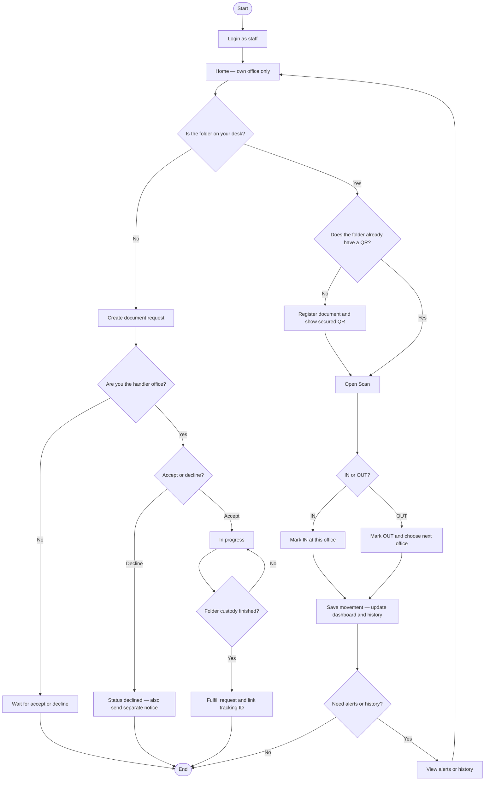
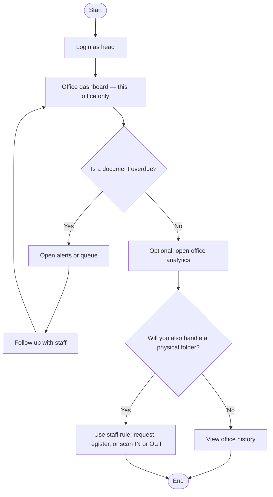
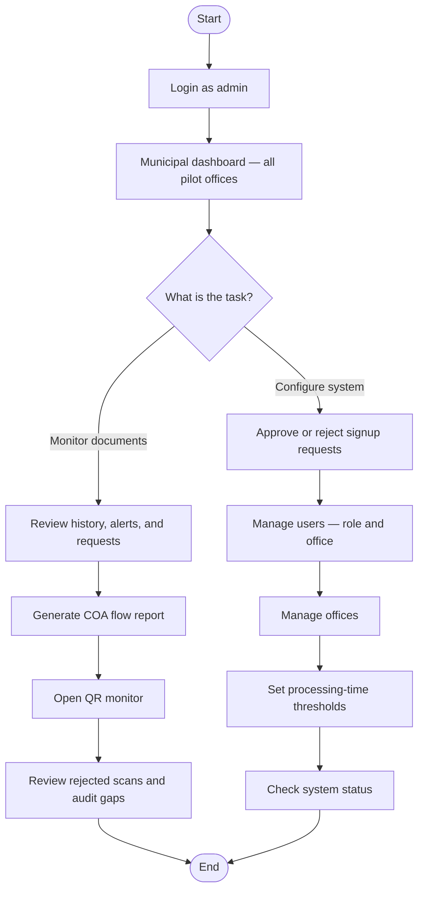

# Live role flowcharts (staff · head · admin)

Use these for the updated Chapter 2 figures. Preview in Cursor, or paste a block into [mermaid.live](https://mermaid.live) and export PNG on a **white** background.

| Figure | Role | Replaces |
|--------|------|----------|
| **2-5** | `staff` — department member / clerk | Old clerk “scan only” figure |
| **2-5b** | `head` — department head (one office) | Old head figure |
| **2-5c** | `admin` — municipal monitor + system config | Old 2-5c Accountant **and** 2-5d Admin (one role in the app) |

Offices: **ENG · HR · BUD · ACC · TRE · MAY**

---

## Figure 2-5 — Staff

**Footer:** If the folder is not on the desk, request it. If it is on the desk, the holding office registers and scans. Staff cannot open municipal COA reports or system settings.

---

## Figure 2-5b — Department head

**Footer:** A head monitors one office. A head does not manage users, offices, thresholds, or municipal COA reports.

---

## Figure 2-5c — Admin

**Footer:** Daily IN/OUT on the DV trail is done by **staff**. Admin monitors the municipality, exports COA flow summaries, and configures the system. SmartFlow does not approve payment or produce financial statements.

---

## Shape map

| Mermaid | Word symbol |
|---------|-------------|
| `([Start])` / `([End])` | Oval |
| `[Process]` | Rectangle |
| `{Question?}` | Diamond |
